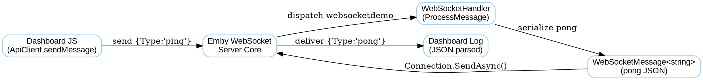

# 📘 Emby WebSocket Demo Plugin (4.8.11)

This tutorial walks you through creating a **minimal WebSocket demo plugin** for Emby Server **4.8.11.0**.  
It adds a custom channel named **`websocketdemo`**, a dashboard test page, and demonstrates sending JSON messages from the client to the server and back.

---

## 🚀 What It Does
- Dashboard button → sends a **`ping`** JSON payload over Emby’s WebSocket.  
- Server handler (`WebSocketHandler`) → deserializes, logs, and replies with a **`pong`** JSON payload.  
- Dashboard page → logs both the sent request and the server’s reply in real time.  

---

## 📂 Plugin File Structure
```
WebSocketDemo/
 ├─ Plugin.cs
 ├─ WebSocket/
 │   └─ WebSocketHandler.cs
 ├─ WebUI/
 │   ├─ WebSocketTest.html
 │   └─ WebSocketTest.js
 ├─ Properties/
 │   └─ AssemblyInfo.cs
 └─ WebSocketDemo.csproj
```

---

## 🛠 Step 1 — `Plugin.cs`
Registers the dashboard test page and the JS controller.  
Notice how each page has a **distinct `Name`** (HTML vs JS).

```csharp
public override IEnumerable<PluginPageInfo> GetPages()
{
    return new[]
    {
        new PluginPageInfo
        {
            Name = "WebSocketTest",
            EmbeddedResourcePath = GetType().Namespace + ".WebUI.WebSocketTest.html"
        },
        new PluginPageInfo
        {
            Name = "WebSocketTestjs",
            EmbeddedResourcePath = GetType().Namespace + ".WebUI.WebSocketTest.js"
        }
    };
}
```

---

## 🛠 Step 2 — `WebSocketHandler.cs`
Implements **`IWebSocketListener`**.  
Emby automatically discovers and hooks it into the WebSocket system.

```csharp
public class WebSocketHandler : IWebSocketListener
{
    private readonly IJsonSerializer _json;
    private readonly ILogger _logger;

    public string Name => "websocketdemo";

    public WebSocketHandler(IJsonSerializer json, ILogger logger)
    {
        _json = json;
        _logger = logger;
    }

    public async Task ProcessMessage(WebSocketMessageInfo message)
    {
        _logger.Info("[websocketdemo] Incoming raw: {0}", message.Data);

        JsonMessage msg;
        try
        {
            msg = _json.DeserializeFromString<JsonMessage>(message.Data);
        }
        catch (Exception ex)
        {
            _logger.ErrorException("[websocketdemo] Failed to parse JSON", ex);
            return;
        }

        if (msg?.Type == "ping")
        {
            var response = new JsonMessage
            {
                Type = "pong",
                UserId = msg.UserId,
                Payload = "Server time: " + DateTime.UtcNow.ToString("HH:mm:ss")
            };

            var reply = new WebSocketMessage<string>
            {
                MessageType = Name,
                Data = _json.SerializeToString(response)
            };

            await message.Connection.SendAsync(reply, CancellationToken.None);
            _logger.Info("[websocketdemo] Sent PONG back to client {0}", message.Connection.Id);
        }
    }
}
```

---

## 🛠 Step 3 — `WebSocketTest.html`
Defines a dashboard page with Emby’s **`data-controller`** attribute pointing to our JS file.

```html
<div id="WebSocketTestPage"
     data-role="page"
     class="page type-interior pluginConfigurationPage"
     data-controller="__plugin/WebSocketTestjs">

    <div class="content-primary">
        <h1>🔌 WebSocket Test</h1>
        <p>This page tests the demo WebSocket channel.</p>

        <button id="btnPing" is="emby-button" class="raised button-submit block">Send Ping</button>
        <textarea id="logBox" style="width:100%;height:200px;"></textarea>
    </div>
</div>
```

---

## 🛠 Step 4 — `WebSocketTest.js`
The **correct** Emby way is to subscribe to the **generic `"message"` event** and filter on `MessageType`.

```javascript
define([], function () {
    return function (view) {
        var btn, logBox;

        function log(msg) {
            var ts = new Date().toLocaleTimeString();
            logBox.value += "[" + ts + "] " + msg + "\n";
            logBox.scrollTop = logBox.scrollHeight;
        }

        function onWebSocketMessage(e, msg) {
            if (msg && msg.MessageType === "websocketdemo") {
                try {
                    var data = JSON.parse(msg.Data || "{}");
                    log("✅ Response: " + JSON.stringify(data));
                } catch (ex) {
                    log("⚠️ Raw: " + (msg.Data || ""));
                }
            }
        }

        view.addEventListener("viewshow", function () {
            btn = view.querySelector("#btnPing");
            logBox = view.querySelector("#logBox");

            log("WebSocketTest loaded, ready.");

            Events.on(ApiClient, "message", onWebSocketMessage);

            btn.addEventListener("click", function () {
                log("Sending ping → websocketdemo…");

                var payload = {
                    Type: "ping",
                    UserId: ApiClient.getCurrentUserId() || "",
                    Payload: "Hello from dashboard"
                };

                ApiClient.sendMessage("websocketdemo", JSON.stringify(payload));
            });
        });

        view.addEventListener("viewdestroy", function () {
            Events.off(ApiClient, "message", onWebSocketMessage);
        });
    };
});
```

---

## 🔄 Flowchart — Message Cycle



---

## ⚠️ Pitfalls & Mistakes to Avoid
- **Wrong event**: `ApiClient.on("websocketdemo", …)` → ❌ not in Emby.  
  Use `Events.on(ApiClient, "message", …)` and filter on `MessageType`.  
- **Wrong server calls**: methods like `SendMessageToUser` appear in online docs but **don’t exist in Emby**.  
  Use `message.Connection.SendAsync(WebSocketMessage<T>, CancellationToken)`.  
- **Wrong plugin overrides**: `Init`, `GetServices` are not valid in Emby 4.8.11 plugins.  
- **JS/HTML mismatch**: make sure HTML page `data-controller="__plugin/WebSocketTestjs"` points to the **JS file**, not the HTML.  
- **Serialization errors**: always send **stringified JSON** from JS, not raw objects.  

---

## ✅ Conclusion
This minimal plugin proves:
- Emby plugins can register their own WebSocket channels.  
- You can send arbitrary JSON between dashboard pages and the server.  
